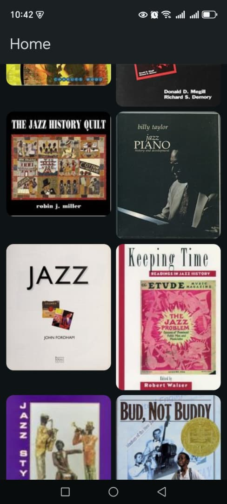
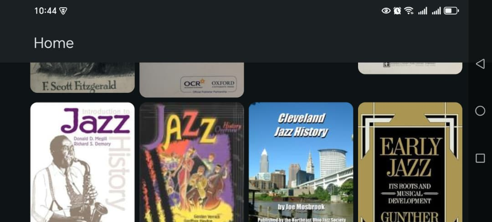

# BookShelf

BookShelf es una aplicación Android que permite buscar libros utilizando la API pública de Open Library. Este proyecto fue desarrollado como práctica personal para aprender y aplicar conceptos de Android moderno con Kotlin y Jetpack Compose.

## Capturas de pantalla

**Pantalla principal (Portrait)**



**Pantalla principal (Landscape)**



## Características

- Búsqueda de libros por título, autor o palabra clave.
- Visualización de resultados con portada, título, autor(es) y año de publicación.
- Consumo de la API de Open Library (sin necesidad de clave).
- Interfaz de usuario construida con Jetpack Compose.
- Manejo de estado con ViewModel y StateFlow.
- Arquitectura limpia con separación de capas.
- Tests unitarios para ViewModel y repositorio.

## Tecnologías utilizadas

- **Kotlin** – Lenguaje principal.
- **Jetpack Compose** – UI declarativa.
- **ViewModel** – Manejo de estado y ciclo de vida.
- **Corrutinas y Flow** – Programación asíncrona.
- **Retrofit** – Cliente HTTP.
- **Kotlinx Serialization** – Parseo de JSON.
- **JUnit** y **kotlinx-coroutines-test** – Tests unitarios.

## Cómo ejecutar el proyecto

1. Clona el repositorio:
   ```bash
   git clone https://github.com/jasv18/BookShelf.git
   ```
2. Abre el proyecto con Android Studio (Iguana o superior).

3. Sincroniza las dependencias con Gradle.

4. Ejecuta la aplicación en un emulador o dispositivo físico.

## Tests
Para ejecutar los tests unitarios:
   ```bash
   ./gradlew testDebugUnitTest
   ```
## Contribuciones
Las contribuciones son bienvenidas. Si encuentras algún error o tienes una sugerencia, abre un issue o envía un pull request.

## Licencia

Copyright 2025 José Sanguinetti

Licensed under the Apache License, Version 2.0 (the "License");
you may not use this file except in compliance with the License.
You may obtain a copy of the License at

    http://www.apache.org/licenses/LICENSE-2.0

Unless required by applicable law or agreed to in writing, software
distributed under the License is distributed on an "AS IS" BASIS,
WITHOUT WARRANTIES OR CONDITIONS OF ANY KIND, either express or implied.
See the License for the specific language governing permissions and
limitations under the License.